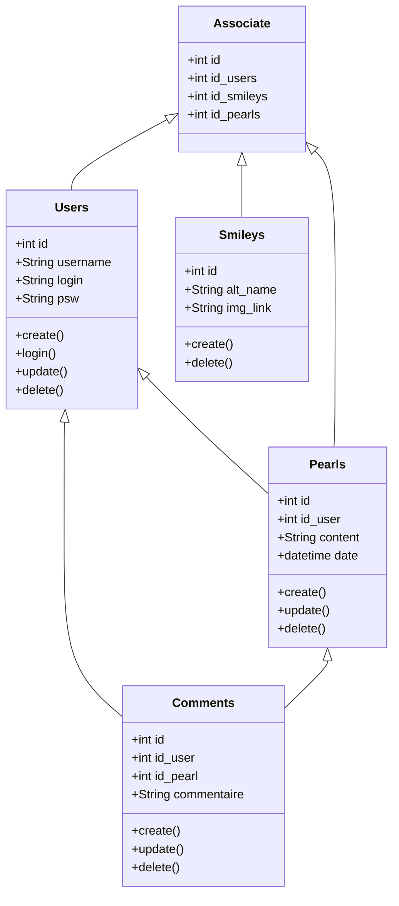

# python_project_temp
IPI first project in Python + flask


# The idea
Be able to save all funny and WTF moment of our firends / colleagues in a small catchy sentence or image


# HOW TO RUN

use virtualenv
```bash
source flask_api/env/bin/activate
```
then you need to run the react front
```bash
yarn start
```

and the flask api
```bash
yarn start-api
```

and youre up and running !

# Features
- account Creation / Login
- send post (phrase and images)
- react to post (commentary or emote)
- filter and search

# Plus
beautiful UI and ability to style post as we like to match the image / sentence

# Tables and joins



     
